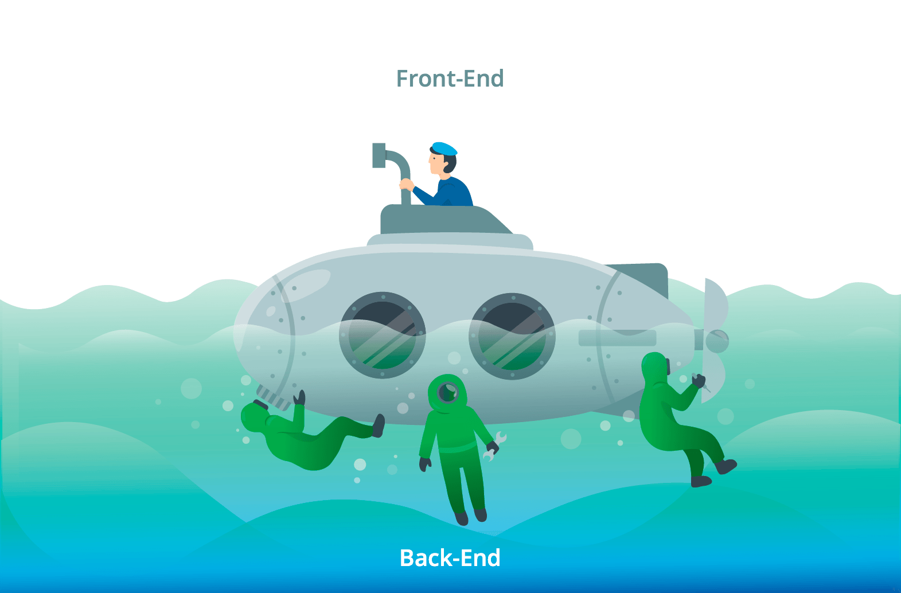

# ¿Cómo funciona Internet?

Antes de que podamos empezar a aprender sobre todas las tecnologías y herramientas a ser utilizadas en este curso, necesitamos aprender:

1. Cómo funciona la web, 
2. Y qué constituye exactamente el desarrollo de Full Stack.

## ¿Qué pasa cuándo abrimos el navegador y visitamos una página web?

Al tipear cualquier sitio, **la computadora envía una solicitud como un paquete que incluye la dirección IP del sitio web al cual querés acceder.** Una dirección IP es un identificador de la red. 

La dirección IP permite a los servidores identificar a qué sitio web queremos tener acceso, y **manda las solicitudes a través de cables o satelites que eventualmente se conectan a cables utilizando tu servicio proveedor de Internet.**

En un nivel muy básico, **Internet es básicamente la conexión de cables a computadoras con un tipo de protocolo específico.** 

Si tu solicitud llega al servidor, puede enviar de vuelta el sitio web que solicitaste, pero el contenido del sitio web is demasiado grande para enviar de vuelta a través de un solo paquete de datos. La manera en la que un servidor resuelve esto, es a través del **envío en diferentes paquetes de datos, los cuales tienen las instrucciones de cómo volver y juntarse con los otros paquetes una vez que lleguen a su destino final**. 

**A los paquetes no les importa cómo llegan a vos, sino la manera más rápida en llegar.** Estos paquetes podrían tomar diferentes rutas para llegar a tu dispositivo, con tal de llegar rápido. Usualmente esto ocurre súper rápido.

Esto es todo lo que necesitamos saber por ahora sobre cómo funciona Internet.

## ¿Qué es Full Stack?

Hay dos componentes principales de un sitio web: La parte **Front End** de un sitio y la parte **Back End.** 

La frontend es la **parte que el usuario puede ver en el sitio**, y el backend es **la parte encargada de los mecanismos y la lógica.**

Por ejemplo, cuando entramos a Facebook, podemos ver los colores y el formato del contenido eso sería la parte frontend; la parte back end es la que decide qué contenido mostrar, y saca toda esta información alojada en una base de datos. 

**La parte de front end usualmente contiene el uso de 3 componentes:**
1. HTML,
2. CSS, 
3. Javascript

Esos son los 3 contenidos de frontend que los sitios web modernos usan hoy en día. 

* HTML significa lenguaje de marcado de hipertexto, y cada sitio web tiene esto. Es la estructura del sitio y podés verla al hacer click derecho y seleccionar inspeccionar, o ver código fuente.

* CSS significa Cascading Style Sheets. Serían como unas fichas de estilo. Con CSS se definen cuestiones del sitio web como colores, fuentes, bordes, etc. Casi todos los sitios web lo tienen para que luzcan lindos.

* Javascript nos permite interactuar con el sitio web incluyendo la lógica. De otra manera, si el sitio no hace nada, solamente muestra información. Este tipo de sitios se conocen como sitios estáticos. 

Para cualquier sitio, siempre se utilizan estas herramientas de frontend. Es en el área de backend donde hay una gran variedad de opciones y herramientas que se pueden utilizar. 

**La parte de backend de un sitio tiene 3 componentes:**

1. El lenguaje utilizado.
2. El marco de trabajo (framework) utilizado para ese lenguaje.
3. La base de datos a la cual se conectan.

Opciones como PHP, Node.js, Ruby/Rails, Java, Python, etc, son todas opciones viables para un sitio web.

