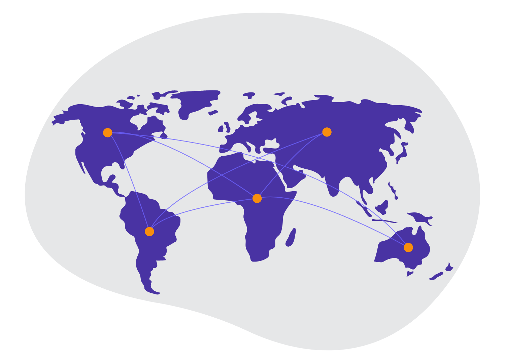
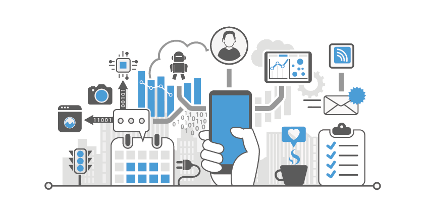

# ¿Cómo funciona Internet?
{: .no_toc }

Antes de que podamos empezar a aprender sobre todas las tecnologías y herramientas a ser utilizadas en este curso, necesitamos aprender:

1. TOC
{:toc}

## ¿Qué pasa cuándo abrimos el navegador y visitamos una página web?

Al escribir la dirección de cualquier sitio, **la computadora envía una solicitud como un paquete que incluye la dirección IP del sitio web al cual querés acceder.** Una dirección IP es un identificador de la red. 

La dirección IP permite a los servidores identificar a qué sitio web queremos tener acceso, y **manda las solicitudes a través de cables o satelites que eventualmente se conectan a cables utilizando tu servicio de Internet.** 

En un nivel muy básico, **Internet es básicamente la conexión de cables a computadoras con un protocolo específico.** 

Si tu solicitud llega al servidor, este responde enviando de vuelta el sitio web que solicitaste. Como el contenido que solicitaste es muy grande y no se puede enviar de una sola vez, el servidor envía el contenido solicitado en diferentes **paquetes de datos**, que luego se vuelven a juntar para armar el contenido nuevamente.

**A los paquetes no les importa cómo llegan a vos, sino la manera más rápida en llegar.** Estos paquetes podrían tomar diferentes rutas para llegar a tu dispositivo, con tal de llegar rápido.

Esto es todo lo que necesitamos saber por ahora sobre cómo funciona Internet.

## ¿Qué es Full Stack?

Hay dos componentes principales de un sitio web: La parte **Front-End** de un sitio y la parte **Back-End.** 

La front-end es la **parte que el usuario puede ver en el sitio** (lo que se ve), y el back-end es **la parte encargada de los mecanismos y la lógica** (lo que no se ve).

Por ejemplo, cuando entramos a Facebook, podemos ver los colores y el formato del contenido, eso sería la parte del front-end; la parte del back-end es la que decide qué contenido mostrar, y saca toda esta información alojada en una base de datos. 

### Tecnologías del Frontend
**La parte de front-end usualmente requiere el uso de estas tres tecnologías:**

#### HTML - El esqueleto 
HTML ("Hypertext Markup Language") no es un lenguaje de programación. Es un lenguaje de marcado que le dice a los navegadores web cómo estructurar las páginas web que estás visitando.

En su corazón, HTML es un lenguaje muy sencillo compuesto de elementos, que se pueden aplicar a piezas de texto para darles un significado diferente en un documento (¿Esto es un párrafo? ¿Esto es una lista con viñetas? ¿Esto es parte de una tabla?), estructura un documento en secciones lógicas (¿Tiene una cabecera? ¿Tres columnas de contenido? ¿Un menú de navegación?), e incrusta contenido como imágenes y vídeos en una página. Este módulo introducirá los dos primeros de estos, e introduce conceptos fundamentales y la sintaxis que necesitas para entender HTML.

#### CSS

Las Hojas de estilo en cascada (del ingles Cascading Stylesheets CSS) es la siguiente tecnología que aprenderemos después de HTML. Mientras que HTML se utiliza para definir la estructura y la semántica del contenido, CSS se usa para darle estilo y posicionarlo visualmente. CSS se puede usar, por ejemplo, para cambiar la fuente, el color, el tamaño y el espaciado del contenido, para formar multiples columnas, añadir animaciones y otros elementos decorativos.

#### Javascript
JavaScript es un lenguaje de programación que te permite implementar cosas complejas en páginas web. Cada vez que una página web hace algo más que sentarse ahí y mostrar información estática para que la veas — mostrando actualizaciones de contenido oportunas, mapas interactivos, gráficos animados 2D/3D, desplazando máquinas reproductoras de video, o más, puedes apostar que probablemente JavaScript esté involucrado .

Para cualquier sitio, siempre se utilizan estas herramientas de front-end. 
Es en el área de backend donde hay una gran variedad de opciones y herramientas que se pueden utilizar. 

