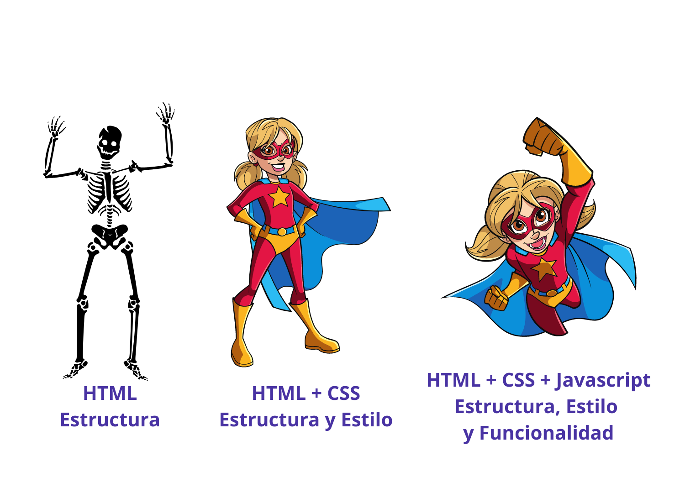

# ¿Cómo funciona Internet?
{: .no_toc }

{: width="650" }{: .center-image}

Antes de que podamos empezar a aprender sobre todas las tecnologías y herramientas a ser utilizadas en este curso, necesitamos aprender:

1. TOC
{:toc}

## ¿Qué pasa cuándo abrimos el navegador y visitamos una página web?

Al escribir la dirección de cualquier sitio, **la computadora envía una solicitud como un paquete que incluye la dirección IP del sitio web al cual querés acceder.** Una dirección IP es un identificador de la red. 

La dirección IP permite a los servidores identificar a qué sitio web queremos tener acceso, y **manda las solicitudes a través de cables o satelites que eventualmente se conectan a cables utilizando tu servicio de Internet.** 

En un nivel muy básico, **Internet es básicamente la conexión de cables a computadoras con un protocolo específico.** 

{: width="650" }{: .center-image}

Si tu solicitud llega al servidor, este responde enviando de vuelta el sitio web que solicitaste. Como el contenido que solicitaste es muy grande y no se puede enviar de una sola vez, el servidor envía el contenido solicitado en diferentes **paquetes de datos**, que luego se vuelven a juntar para armar el contenido nuevamente.

**A los paquetes no les importa cómo llegan a vos, sino la manera más rápida en llegar.** Estos paquetes podrían tomar diferentes rutas para llegar a tu dispositivo, con tal de llegar rápido.

Esto es todo lo que necesitamos saber por ahora sobre cómo funciona Internet.

## ¿Qué es Full Stack?

Hay dos componentes principales de un sitio web: La parte **Front-End** de un sitio y la parte **Back-End.** 

La front-end es la **parte que el usuario puede ver en el sitio** (lo que se ve), y el back-end es **la parte encargada de los mecanismos y la lógica** (lo que no se ve).

{: width="650" }{: .center-image}

Por ejemplo, cuando entramos a Facebook, podemos ver los colores y el formato del contenido, eso sería la parte del front-end; la parte del back-end es la que decide qué contenido mostrar, y saca toda esta información alojada en una base de datos. 

## Tecnologías del Frontend
**La parte de front-end usualmente requiere el uso de estas tres tecnologías:**
{: width="650" }{: .center-image}

### HTML - El esqueleto 💀 
Estrictamente hablando, HTML no es un lenguaje de programación, sino un lenguaje de marcado que define la estructura de tu contenido en un sitio web. En concreto, consiste en una serie de elementos utilizados para encerrar diferentes partes del contenido para que se vean o se comporten de una determinada manera, lo que lo convierte en el esqueleto del sitio web.

Los navegadores web -Chrome, Firefox, Safari, Opera, etc.- leen e interpretan ese código HTML del que están hechos los sitios web con el objetivo de mostrar un contenido que sea entendible para los usuarios que lo visitan. ¿Qué significa? Cuando accedemos a cualquier sitio web, el navegador a través del cual lo hacemos, pide al servidor donde está alojado dicho sitio que envíe el documento. Este es un documento HTML que el navegador interpreta para mostrar el contenido al usuario final.

### CSS 💅🏼

CSS son las siglas en inglés para «hojas de estilo en cascada» (Cascading Style Sheets). Básicamente, es un lenguaje que maneja el diseño y presentación de las páginas web, es decir, cómo lucen cuando un usuario las visita. Funciona junto con el lenguaje HTML que se encarga del contenido básico de las páginas.
Se les denomina hojas de estilo «en cascada» porque puedes tener varias hojas y una de ellas con las propiedades heredadas (o «en cascada») de otras.

### Javascript 💃🏻
JavaScript es un lenguaje de programación que se utiliza principalmente del lado del cliente, ya que permite crear la interfaz de usuario de sitios web, aunque también se puede usar para realizar tareas del lado del servidor, a través de Node.js.

¿Y qué podemos crear del lado del front-end? Un sitio web dinámico que incorpore lógica de presentación, efectos, animaciones, acciones que se activan al pulsar botones y ventanas con mensajes de aviso al usuario, por ejemplo.

## Conclusión
Con estos conceptos, deberíamos entender que para cualquier sitio, siempre se utilizan estas herramientas de front-end. 

Es en el área de backend donde hay una gran variedad de opciones y herramientas que se pueden utilizar.

