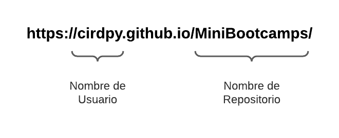

# Github Pages

Se trata de un servicio de hosting de sitios proveído por Github. Toma los archivos HTML, CSS y JavasScript directo desde el repositorio en Github, esto de manera a publicar el sitio web.

# Publicación en Internet

Lo primero que debés tener antes de publicar tu sitio web es el contenido albergado en un repositorio de Github.

Vamos a proceder a publicar en internet tu proyecto del portfolio, para ello debe estar ya en su repositorio en Github.

### 1. Configuración
Seleccioná tu repositorio de portfolio en Github y hacé clic en la opción "Setting" (Configuraciones) de tu repositorio:
 

### 2. Pages
Luego en el menú lateral seleccioná la opción "Pages" (Páginas).
 

### 3. Rama
Casi al inicio aparece la sección que dice "Branch" (Rama), en esta sección es necesario seleccionar cuál va a ser la rama desde la cual queremos que se haga la publicación. Debería verse algo así:

Luego de seleccionar tu rama, debés guardar tus cambios, simplemente pulsando al botón que dice "Save" (Guardar).

### 4. Refrescar
Toma un momento hacer la publicación, luego de un rato podés refrescar tu navegador y ya debería aparecerte algo como esto:

Así en cuatro sencillos pasos, tu web de portfolio ya se encuentra disponible en Internet.

## Consideraciones finales

Fijate en la URL que te asigna Github Pages.

La primera parte del dominio corresponde a tu nombre de usuario en Github, mientras que el "path" de la URL corresponde con el nombre de tu repositorio.

Esta combinación de nombre de usuario + repositorio es único; de hecho Github no te va a permitir que tengas dos repositorios con el mismo nombre.
